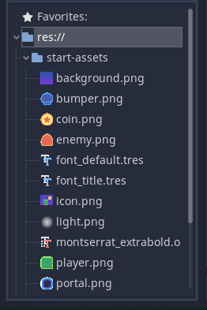

# Downloading Assets
Download the Starting_Assets zip folder by clicking this [link](Starting_Assets.zip)
The zip folder contains the images of every character we need to build our project.
Once you finish downloading and extracting the folder, move it to the game folder that you just created.
Now when you open the godot engine again, you should be able to see the starting-assets folder underneath the ```res://``` folder


<br>
This is necessary to start the project as we need sprites for the characters, villains and the coins.

To get started with creating the character click this [link](Character.md)
