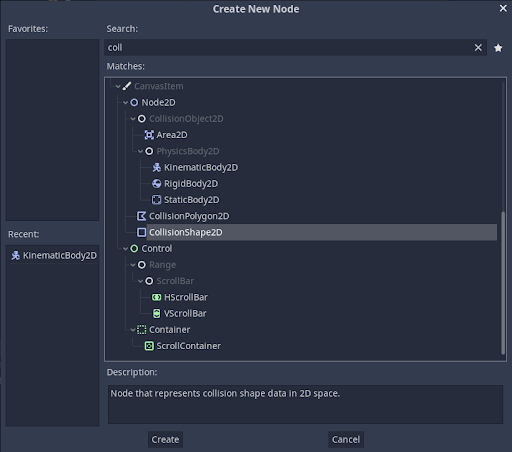
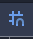
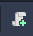
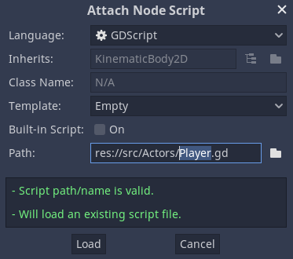

# Making our very own Green Mario

## Character Sprite
To create the character and start with character movement, we need a folder to store the scenes and the source code. For this, we make a folder called ```src```.
To do that, right click on res:// and create a folder.
<br>
Now we start making our character. With src as our source folder, click on ```Other Node``` and search for <b>Kinematicbody2D</b>.

<br>
Rename the object as player. 
<br>
Now, we need to make a collsion box for the player. For that click the ```+``` icon and select ```CollisionShape2D``` from among the list
<br>
You'll need to give it a shape. For that, we click on the inspector, and in the shape drag down, we click on ```New Rectangle Shape 2D```.
You'll now see a blue box appear in the screen. You can change the dimensions of this as per your preference.
<br>

Now we can add our player sprite onto the screen. Select the player node on the left, then drag and drop the player.png file from our assets to the screen. It will automatically add it as a sprite. Now to see the blue box above our player, drag the player child element on the left panel above the CollisionShape2D element.
We want to allign the character such that it fixes itself to the horizontal. So drag the character sprite so that it touches the horizontal axis. To be precise while doing it, Click on the magnet at the top of the screen to activate gridlock mechanism.


Now align the blue box with the character sprite. Be careful to not cover the entire character as it may cause unwanted interactions. Cover some parts of the characters like show below.
!{cover}(Images/cover.png)

## Scripting our character
To start coding our script, we'll first save the scene. Press ```Ctrl+S``` and select the source folder. Create a new folder (Say, Actors) and save it.
Then, to start scripting our character, select on the player Node and click on the script icon on the top right of our node panel.


A similiar pop up should open.<br>


Set inherits to KinematicBody2D and Template to EMPTY. Once you press the create, the script editor will open up.

Since both our player and the enemy sprite will move around similiarly, we can use a common script for both of them and term it as Actor script.
Click on File >>> New Script and save it in our Actor file as ```Actor.gd```. You'll automatically jump to actor script.
As you can see, the Actor is already defined by the script as a Node using the ```extends``` keyword. We need to change it to KinematicBody2D to make it the same type as player. 
In the same way, when we make the player and enemy sctipt, we can register them as Actors to automatically include the Actor script to their code. For that we should register the actor script using ```class_name Actor```


### General Movement Settings
We'll start by typing the function that is built into Godot.

```func _physics_process(delta: float) -> void:```

Godot will call this function every frame. So this is where you want to store the character movement.

We'll add a Vector variable called velocity. 

``` var velocity: = Vector2(300,0)```

This will store an X Value of 300 and a Y Value of 0 to the velocity variable. We can see this in action with another function ```move_and_slide()```. move and slide is a function built into KinematicBody2D node and it takes care of moving our actors.<br>
Here, type the following:

```move_and_slide(velocity)```

Now if we go to our scene, we can see the character move to the right at a speed of 300. 
<br>
Now, the issue is, we want our velocity to be accessible outside the physics process function as well, so what we do is we take it above the function and make it accessible everywhere.
<br> Now, we'll make it zero as the characters shouldn't move on their own. Now, to have something like gravity, we can add another variable called gravity to act as gravitational accelaration.

```var gravity: = 1000.0```

We can make it a vector value as well, but considering it only has one direction where it acts to, that isn't necessary.
<br>
Now inside physics process, we can have a function that changes the value of velocity in every frame.

``` velocity.y += gravity*delta```

delta is the timeframe value given by the processor itself. So, now it will change the value of velocity with respect to time.
<br>
To make this value easily editable, we can export it and we will be able to see it on the side. just add the ```export``` keyword to the side of the variable definiton.

```export var gravity: = 1000.0```

