# Making our very own Green Mario

## Character Sprite
To create the character and start with character movement, we need a folder to store the scenes and the source code. For this, we make a folder called ```src```.
To do that, right click on res:// and create a folder.
<br>
Now we start making our character. With src as our source folder, click on ```Other Node``` and search for <b>Kinematicbody2D</b>.
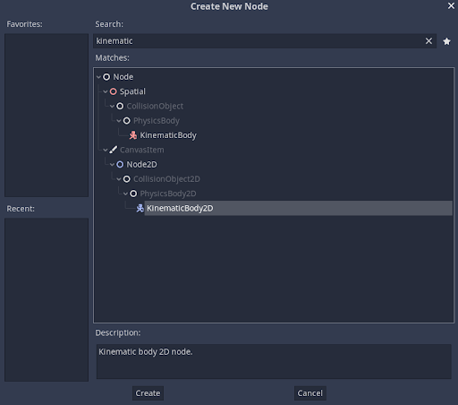
<br>
Rename the object as player. 
<br>
Now, we need to make a collsion box for the player. For that click the ```+``` icon and select ```CollisionShape2D``` from among the list
<br>
You'll need to give it a shape. For that, we click on the inspector, and in the shape drag down, we click on ```New Rectangle Shape 2D```.
You'll now see a blue box appear in the screen. You can change the dimensions of this as per your preference.
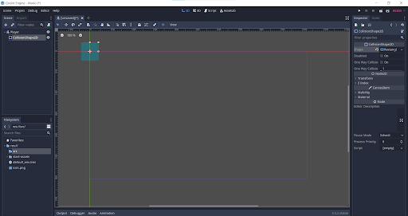 <br>

Now we can add our player sprite onto the screen. Select the player node on the left, then drag and drop the player.png file from our assets to the screen. It will automatically add it as a sprite. Now to see the blue box above our player, drag the player child element on the left panel above the CollisionShape2D element.
We want to allign the character such that it fixes itself to the horizontal. So drag the character sprite so that it touches the horizontal axis. To be precise while doing it, Click on the magnet at the top of the screen to activate gridlock mechanism.


Now align the blue box with the character sprite. Be careful to not cover the entire character as it may cause unwanted interactions. Cover some parts of the characters like show below.
!{cover}(Images/cover.png)

## Scripting our character
To start coding our script, we'll first save the scene. Press ```Ctrl+S``` and select the source folder. Create a new folder (Say, Actors) and save it.
Then, to start scripting our character, select on the player Node and click on the script icon on the top right of our node panel.


A similiar pop up should open.<br>


Set inherits to KinematicBody2D and Template to EMPTY. Once you press the create, the script editor will open up.

Since both our player and the enemy sprite will move around similiarly, we can use a common script for both of them and term it as Actor script.
Click on File >>> New Script and save it in our Actor file as ```Actor.gd```. You'll automatically jump to actor script.
As you can see, the Actor is already defined by the script as a Node using the ```extends``` keyword. We need to change it to KinematicBody2D to make it the same type as player. 
In the same way, when we make the player and enemy sctipt, we can register them as Actors to automatically include the Actor script to their code. For that we should register the actor script using ```class_name Actor```


### General Movement Settings
We'll start by typing the function that is built into Godot.

```func _physics_process(delta: float) -> void:```

Godot will call this function every frame. So this is where you want to store the character movement.

We'll add a Vector variable called velocity. 

``` var velocity: = Vector2(300,0)```

This will store an X Value of 300 and a Y Value of 0 to the velocity variable. We can see this in action with another function ```move_and_slide()```. move and slide is a function built into KinematicBody2D node and it takes care of moving our actors.<br>
Here, type the following:

```velocity = move_and_slide(velocity)```

Move and slide will move our character with the given velocity and if it hits any object, it will return a value of velocity so that our character will stop there.
Now if we go to our scene, we can see the character move to the right at a speed of 300. 
<br>
Now, the issue is, we want our velocity to be accessible outside the physics process function as well, so what we do is we take it above the function and make it accessible everywhere.
<br> Now, we'll make it zero as the characters shouldn't move on their own. Now, to have something like gravity, we can add another variable called gravity to act as gravitational accelaration.

```var gravity: = 1000.0```

We can make it a vector value as well, but considering it only has one direction where it acts to, that isn't necessary.
<br>
Now inside physics process, we can have a function that changes the value of velocity in every frame.

``` velocity.y += gravity*delta```

delta is the timeframe value given by the processor itself. So, now it will change the value of velocity with respect to time.
<br>
To make this value easily editable, we can export it and we will be able to see it on the side. just add the ```export``` keyword to the side of the variable definiton.

```export var gravity: = 1000.0```

Now we can set a maximum speed for the sprite since it shouldn't accelerate to infintity. For that we define a new vector variable Speed.

```export var speed: = Vector2(400.0, 500.0)```

Now we can say, 
<br>```if velocity.y > speed.y: 
velocity.y = speed.y```

With this it wont exceed the maximum.

But now our character is just falling down. We need it to fall onto something. So for that we'll go to 2D view to make a stage.

## Making a Simple Stage
Click on the reset position to reset the player position to 0.

Now to create our level, we need to create a new scene. Click on scene >>> New Scene >>> 2D Scene and name the new scene as Level0. Save it into a new folder called levels.

Select the level template and click on the + button to add a ```TileMap```
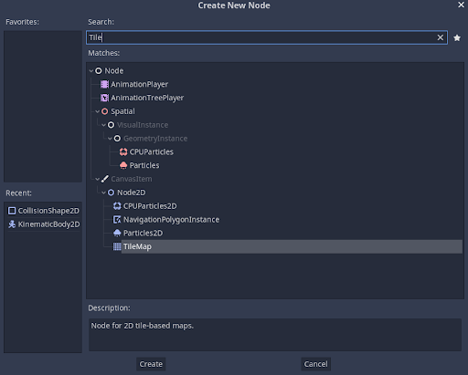
<br>

Then click on TileSet >>> New Tile Set and click on the tile set to open up the tile set editor

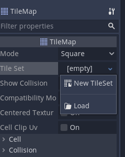
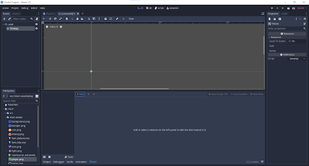

We need to load a texture which the editor will make it into a tile.
For that, first drag and drop our level texture ```tileset.png``` from the assets and put it on the side of the editor. Now, click on ```New Single Tile``` Option and select the region to make our tile. To make it easier, we can again click the magnet button, but this time on the editor, to activate snap options. We can even change the snap options in the Inspector's <b> Snap options</b>.
<br> Now after choosing a suitable size and selecting your tile, you can add a collision space to the tile so that our character will stop after hitting it.

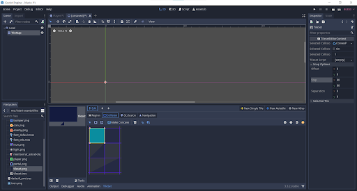

<br> Now by going back to the tile map you'll be able to draw out your level. Firstly, in the inspector, change the cell size to match the tile size that we took

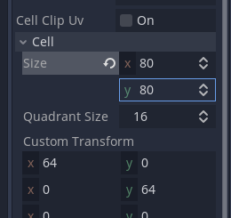
<br>
Now you can click to make your world. After making your map, you can drag and drop your ```player.tscn``` file from the src>Actors folder to place the sprite into the world

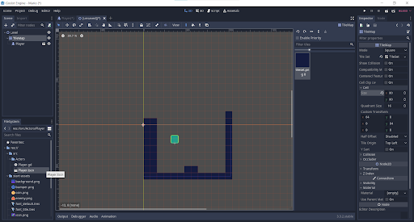
<b> NOTE: </b>Make the player a child class of the Level and not the title map
You can press f6 to watch the animation.


### Setting up layers

There maybe some cases where we need the player to be able to move through walls the enemies cant. To make that, we make each class into a layer. To do that go to ```Project >>> Project Settings``` and name some layers...
<br> Let's say we call it player, enemies and world.

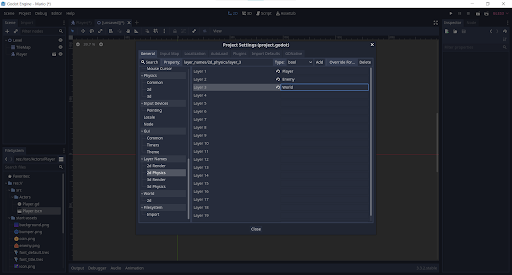
<br>
Now when we click the tile map and open the collisions tab in the Inspector, we can see the layer and the masks. The Layer, tells us which layer this specific map belongs to (ie, world), you can change that by clicking. The mask tells which all objects it will interact with (ie, player and enemy)

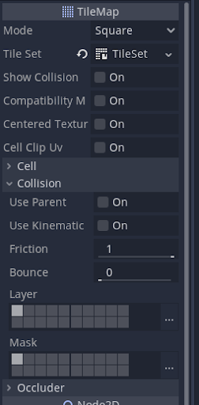
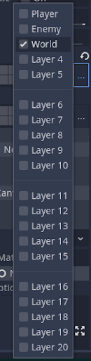
<br>
You can do the same with the player as well. Make sure to change the original player script and not the one sourced into the level.


## Coding actions
First we need to set up input mappings. For that we need to go to ```Project >>> Project Settings>>> Input Map```.<br>
Here we can add the keys for each mapping. We can see some default maps by godot. Add new maps for move_left, move_right and jump by typing it out in the action bar and pressing add. We can also set up keybinds for them by pressing the + key next to the newly added name.

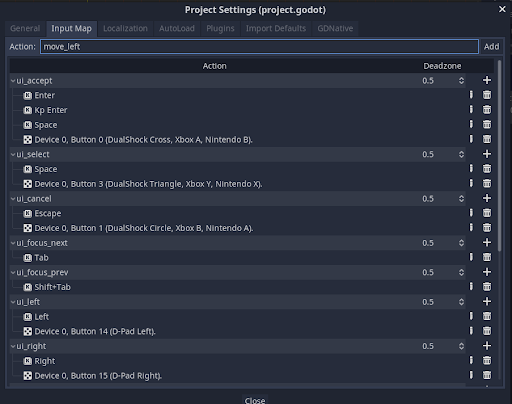

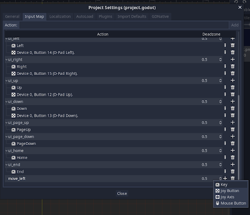

Now we can start coding our characters. In the player script, make sure that it has the code ```extends Actor``` so that everything in actor is applicable over here.

Add our ```_physics_process``` function into it.

Now we need to take input from the user under the physics process function. For that we use the Input function

``` Input.get_action_strength(<Add a movement>)```

This will return a floating point value to give how much the key is pressed. Fully pressing the key will give 1.0 as value. This is useful for if you use joysticks, it can return decimal values depending on how much it is pressed.

Now using this, we can define the direction of movement for our character. Right direction has to be positive and left direction has to be negative. For that we'll define a new Vector variable direction, which will take the values from the Inputs.

```var direction: = Vector2(Input.get_action_strength("move_right") - Input.get_action_strength("move_left"), 0.0)```

<i>Note that we didnt add jump yet.</i>

We'll encounter an issue where there will be a framerate gap between us pressing and the action being observed. This is because Godot runs the extend physics function first then the script physics function. This helps in giving a gravity to the object, but it does cause the framerate drop as the move and slide function is in the extends one. To make it right, we can put the move and slide function in the player physics rather than in the actor physics. But this will cause an error as we are setting the direction.y to zero right before the movement. To change that we can put 1.0 instead of 0.0 in the above code.

<b> NOTE:</b> In vertical direction, downwards is positive and upwards is negative.

Now to add jump into the mixture, we'll append the code such that the y axis direction changes appropriatey.

```var direction: = Vector2(Input.get_action_strength("move_right") - Input.get_action_strength("move_left"), -1.0 if Input.is_action_just_pressed("jump") else 0.0)```

This will flip the direction if you pressed the jump key. But that will work any time. To make it only work when you're on the floor, we have a function in KinematicBody2D called ```is_on_floor()```
This will allow jump to only be pressed when character is on the floor. 

So, the new direction variable looks like:

```var direction: = Vector2(Input.get_action_strength("move_right") - Input.get_action_strength("move_left"), -1.0 if is_on_floor() and Input.is_action_just_pressed("jump") else 0.0)```

You can put this as a function to make it neat.

<b> NOTE: </b> For is_on_floor() to work, a floor normal has to be set. For that use the move_and slide function and add the floor normal parameter to it.

``` velocity = move_and_slide(velocity,Vector2.UP)```

Here, Vector2 will act as the upwards normal, showing where the floor is.<br>
Otherwise, we can define the floor normal as a vector variable in the Actors script and use that variable instead. This makes it look cleaner.

Now we still see jumping isnt calculated yet. That is because the velocity isnt calculated yet.
For that we need a new function calculate_move_velocity()


``` 
func calculate_new_velocity(linear_velocity: Vector2, direction: Vector2, speed: Vector2) -> Vector2:
var new_velcity = linear_velocity
new_velocity.x = speed.x * direction.x
new_velocity.y += gravity * get_physics_process_delta_time()
if direction.y = -1.0
    new_velocity.y = speed.y * direction.y
return new_velocity
```

<b> Optional </b>

We can add a variable to check whether the jump is interrupted in between. That way the player can choose till what height to jump.<br>
For that, define a variable, in the physics process and send it as a parameter to calculate new velocity function.

```var is_jump_interrupted: = Input.is_action_just_released("jump") and _velocity.y < 0.0```

This will give a positive value if the jump key is released when the character is moving up.

After adding this as a parameter to the function using a bool value, we can add the following lines of code to add the jump interrupted facility.

```
if is_jump_interrupted:
  new_velocity.y=0.0
```
  
Now we're done with the player's scripts. Click the [link](enemy.md) to go to the enemy's script
