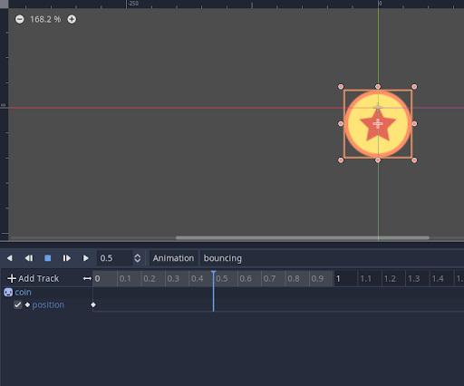

# Let's make our Green Box Rich

You must've seen in Mario games, that Mario goes around collecting coins. How do we make them in our game? First we create a new scene and a new node. The node type should be an ```Area 2D``` and taken from the ```+ Other Node``` option.

## Spriting the coins

Drag and drop the coin sprite from the assets to the scene. Centre it to the origin.<br>
Now add a collision shape to it. This time, CircleShape 2D fits our coin better. We'll need a new layer for the coins as it doesn't fall into the player, enemy or world category. The coin will only have to mask the player as it doesn't interact with anything else. Save the coin into a new folder. Let it be named "Objects". 


### Adding a bit of bounce

Now we'll animate the coin so that it is a bit lively. For that we'll add a new node ```AnimationPlayer```. The animation window will come up in the bottom of the screen as well as some new icons in the top window. <br>


To animate the coin, click the animation menu and choose the new animation. Let's call it bouncing. <br>
A new timeline will have appeared on the animation window. That is a track and is used to change the properties (shown in the Inspector) of the object.


To animate the object, we need to move the sprite and keyframe it (click on the key icon where we want to fix the extreme positions).

 

The above animation on being played will bounce the coin between these two places. There are more properties such as easing into extremes that can be experimented with.

### Dissappear after taking

Add a new animation using the animation menu. Let's call it "fading".
A new timeline will appear, one that will ignore the first animation.

In this one, instead of changing the position of the coin, we'll change the visibility of it. By changing the <b>A</b> value of the Modulate option, the coin's transperancy changes.

 

By keyframing this, we can make a fade oout animation

 

One thing to note is that the animation position of fade timeline ends up affecting the Bounce timeline. So add a keyframe in the beginning of the bounce timeline that makes it Completely Opaque.


## Coding the animation

We can make Godot play the animation from the beginning as well as make the object free itself from queue at the end of the animation. We can use these on the bounce and fade animations respectively.<br>
To make bounce start from the beginning, click on the autoplay button on the right of the animation name <br>

To make the queue_free() function call itself at the end of fade out, put the blue line at the end of the track and select the Call Method Track selection from the Add Track Menu


When the Call window opens, select the parent node (Area2D) and press enter. This will create a new track called functions. 
<br> In functions track you can right click to insert a key 


When the window opens, search for queue_free() function and open it.


This makes the function call queue_free() at the end of animation.

## Coding the coin

Add a script to the coin and call it "Coin.gd"

Add the following code to set a reference to the animation of the coin:

```
onready var anim_player: AnimationPlayer = get_node("AnimationPlayer")
```

This will automatically call get_node and update the value to anim_player when the function ```_ready``` would have given a true value.<br>

Then from the Node, we can use the body_entered function. After connecting it, the following should be there:

```
func _on_body_entered(body: PhysicBody2D) -> void:
    pass
```

Replace the pass with:

```
anim_player.play("fade")
```

Now your coin is ready to be put into the level.


