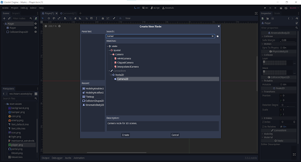

# Creating the monster

## Creating the Sprite
Select player.tscn and duplicate it. Rename it as enemy.tscn. Also rename the "Player" names on the top left.
Now, while selecting the sprite, drag the enemy.png sprite from assets into the texture box.


Adjust the collision shape box for the sprite. Make sure to make minor adjustments to avoid unwanted interactions.

Now, you can notice that the enemy scene also has the player script attached to it. Right click on the enemy and choose extend script.


Let the enemy script Inherit the ACTOR script and change the path to Enemy in the actor script.

Remember to change the layers and mask. The enemy should interact with the player as well as the world.


## Encoding our little orange Monster

The enemies in mario move around at a slow speed and turns around when it hits the wall. The velocity of the enemy should be constant while its direction should change when it hits a wall.

So under the physics process function we add the following:

```
if is_on_wall():
  velocity.x *= -1.0
velocity = move_and_slide(velocity,Vector2.UP)
```

We can also set it such that the enemy, when appearing on screen moves to the left.
We can use the ready function for that.

```
func _ready -> void:
  velocity.x = -speed.x
```

This will give the initial velocity towards the left direction.

Now we need to apply gravity to the enemy so that it doesn't fly around. For that, add the gravity code to physics process:

``` velocity.y += gravity * delta ```

Now we see an issue where enemy stops moving after hitting a wall. That is because move_and_slide resets the value to zero when it hit the wall. So we need to change our code so that it doesn't update the x value of velocity. For that we change the move and slide code to:

``` velocity.y = move_and_slide(velocity,Vector2.UP).y ```

Now the enemy will switch directions when it hits the wall (or the player as we didn't give conditions for losing).

But now, our enemy starts moving even if its outside the screen...<br>
We can stop that by a simple element in Godot called the <b> Visibility Enabler 2D </b><br>


In the left panel, select the enemy scene and right click it to add a new Child Node. When the add node panel opens up, search for VisibilityEnabler2D and add it.

A new red box will appear and as ong as this red box is outside the view, it will freeze every process that has been checked in the Inspector panel.


Make sure that physics process is checked in the right panel.<br>
You can move the red box such that the enemy starts moving the moment it comes in the screen.

To make sure Visibility Enabler works add a line of code to the ready function:

``` set_physics_process(false)```

This way the enemy wont move till on screen.

You might have noticed that the view is fixed and doesn't change... We can change that by going to the player scene and adding a camera node to it. 
For that, rightclick the player scene and add a child node. Find and add Camera2D node to it.
After that on the Inspector panel, make sure Current checkbox is ticked.




This will show a blue rectangle around the player, which is where the view will be when we play the game. We can change the orientation of the camera with respect to the player, but as long as it is a child node of the player node, it will follow the player around in the level.

Now we're done coding the enemy sprite. What we need to see next is the interactions between player and enemy. To move on to the interactions, click on this [link](Interactions.md)
