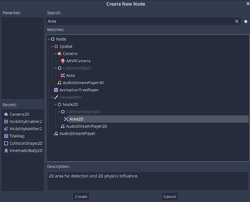
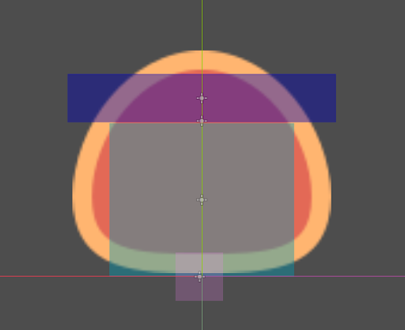
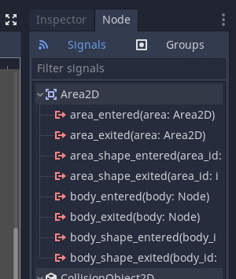
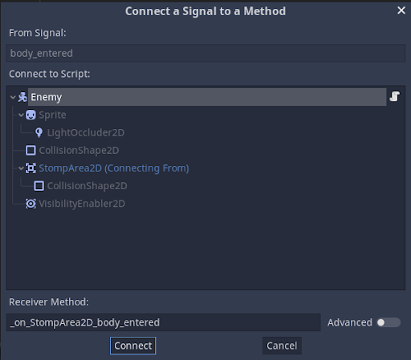
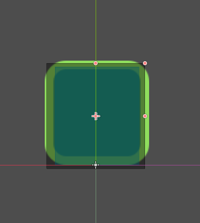
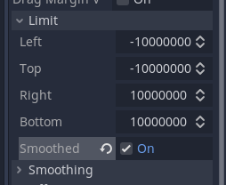
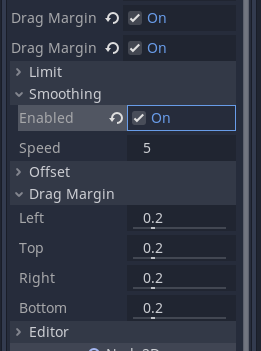
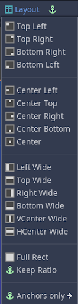
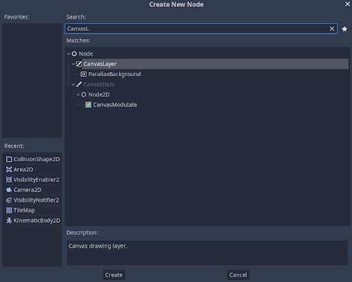
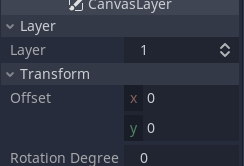

# Let the Games begin

The main interactions between an enemy and the player is the player stomping the enemy to kill it and the enemy hitting the player to kill him. Both the codes have to shared between the player AND the enemy as the death of the enemy will be inside the enemy code while the stomping code will be inside the player and vice versa.

## Lets juice that Orange!!!

To stomp the enemy, the player needs to jump on top of it. To differenciate the top, we need to use a new node called Area 2D. Name it "StompArea2D". Now uncheck every layer except the enemy layer.



In the mask layer, select the player as we need to know when the player enters the area.

For the shape of the detector, add a child node to it as a CollisionShape2D node and use rectangle. Make it a bit easy to kill. Remember to move the stomp detector a bit upward so that the enemy doesnt die on collision as well. In the image, the red cross is the stomp detector origin




### Coding the stomp

When you look at the node of the stomp detector, you will find numerous functions related to it. By clicking on one, you'll be able to add it to your script directly without having to type it out. You just need to select it in the pop up panel.





```
func _on_StompArea2D_area_entered(area: Area2D) -> void:
	pass #replace with function body
```

This function appears in the enemy script. Cut it and move it under ready function.

Now, we need to replace the line "pass". We need our enemy to die when the player hits it. so we replace it with the "die" function (ie, the queue_free() function)

```
func _on_StompArea2D_area_entered(area: Area2D) -> void:
	queue_free()
```

We notice 2 things here. The body dies even if the player hits from underneath the enemy. And that the enemy dies after sometime. 
To correct the first issue add the following line before queue_free():

```
if area.global_position.y > stomp_area.global_position.y:
		return
```

This will not execute queue_free if player hits from bottom.

The second issue, we can ignore from the fact that the player will get an impulse and bounce up after the stomp.

### Stomp Code on player

Create an Area2D node as an enemy detector for the player in the same way as we did for the enemy. Ensure that the detector collision has no Layer and masks only the enemy. Name it "EnemyDetector" 
In the image, the black part is the enemy detector



If this area detects an AREA, it will be the stomp detector and body jumps with the stomp impulse. If the area detects a BODY, it will be the enemy hitting and the player wil die.

So, from the node, we select area entered code and change "pass" to the following code:

```
func _on_EnemyDetector_area_entered(area: Area2D) -> void:
    velocity.y = -impulse
```

And add an export var impulse at the beginning.

``` export var stomp_impulse = 1000.0```

Now we can see that the enemy dies and the player jumps on stomping.


### Game Over Code

From the node, select body entered function and replace "pass" with the queue_free() function.

```
func _on_EnemyDetector_body_entered(body: PhysicsBody2D) -> void:
	queue_free()
```


## Let the Games Begin

The game is nearly made. Make the camera a bit more perfect by adding limits to it on the Inspector Panel. We can limit the camera limits inside the player scene as well, as player is a child node of the level.



The camera shouldn't move out of the world we created. 
<br> We can smoothen the abruptness of the camera boundary hitting the world end by checking the smoothed checkbox.<br>
If you observe closely, we can see that the camera doesnt move for a small area that the camera doesn't move when the character does. We can change that by enabling Drag Margin H and V checkboxes and changing the margin values to 0.



Don't forget to smoothen the movement as well, by toggling the smoothing. You can change the smoothen speed by changing the speed category in the smoothen panel.


<b>Add a background to the world.</b>	You can drag the background into the level node and make it its child node. It will automatically be added as a texture node.
<br> You can select the node and select the layout menu that just appeared and click the ```full rect``` option.



Pull the background node to the top of the child nodes so that it comes behind everything else. <br>
Add a canvas layer node as a child node of the Level template.



Add Background as a child layer of this new node and set its Layer parameter in the Inspector as a highly negative number. The layer attribute decides where it comes and the negative number makes it go all the way in the background.



Now your level is set to go. Have FUN!!!

IT'S MARIO TIME!!!
