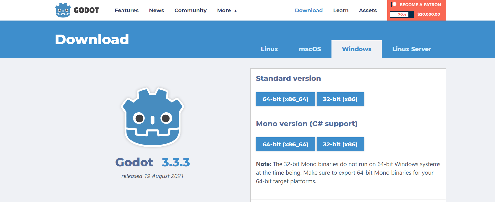
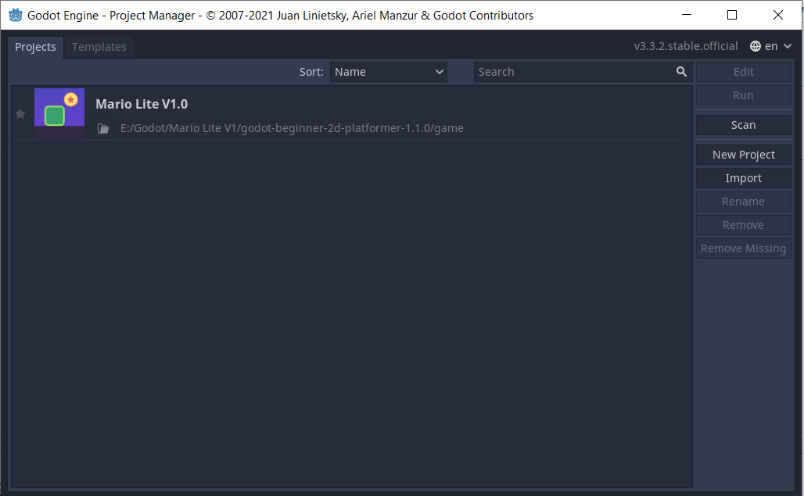
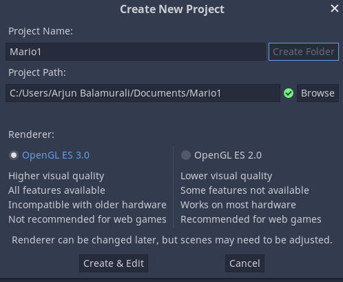

# Shaastra Workshop


# Godot Gamedevelopment Engine
           


</br>

# What is Godot Engine?
Godot is a cross-platform, free and open-source game engine released under the MIT license. Similiar to other game engines like Unity and Unreal Engine, Godot helps to make Games from scratch and code them to perfection. Godot is a much better starting point for beginners due to the less amount of commitment towards it.

# Installation
Click the following [link](https://godotengine.org/download) to download Godot. Download the <b> Standard Version </b> from the page.


# Interface
This is how the screen looks at the beginning

On the middle we can see the different projects that have been created
As you can see, I already made a version of the game. 
To be starting with a new project we click on the ``` New Project ``` button and enter the details. Then click on the ```Create Folder``` button to create a designated folder for our project. After that, click on the ```Create&Edit``` Button to start building.

<br>
This lands us on the 3D interface of Godot. For today, we shall be working with 2D interface, so switch to 2D


Now we're ready to get started.

Click on this [link](Getting_Started/Assets.md)
